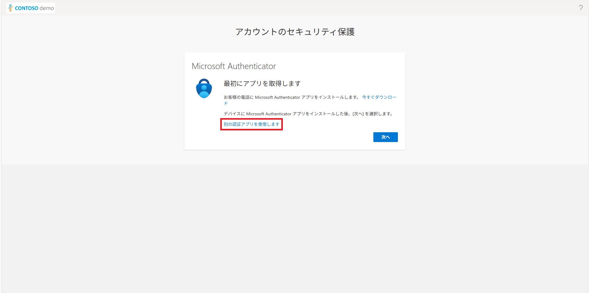
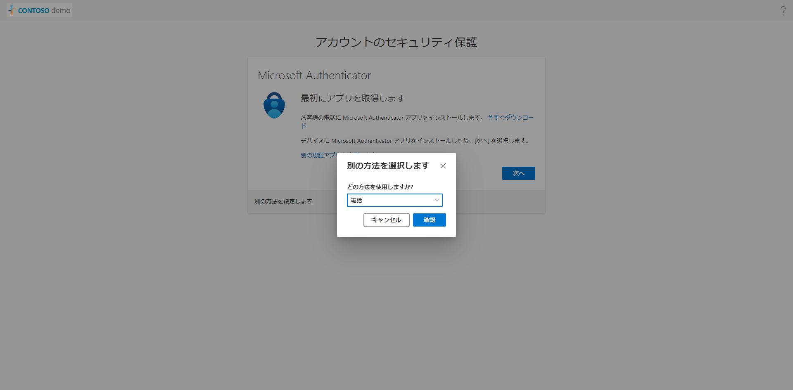
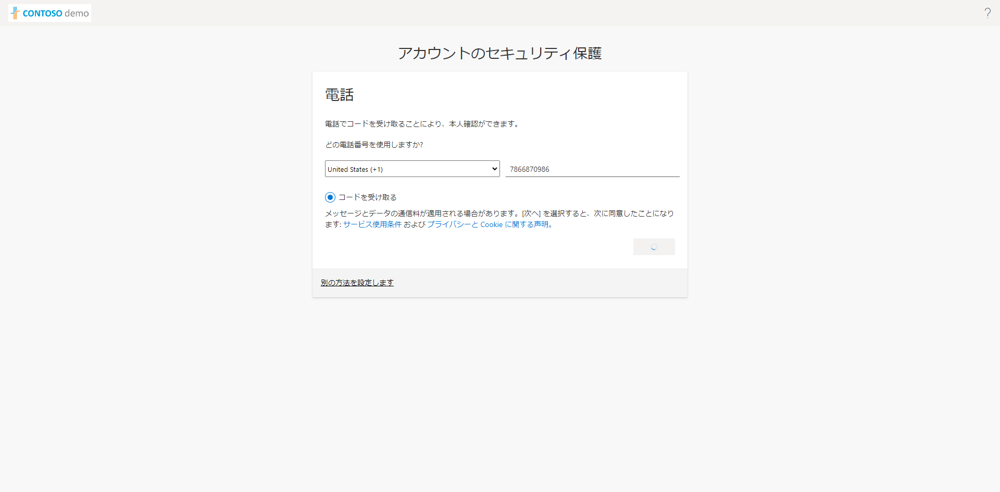
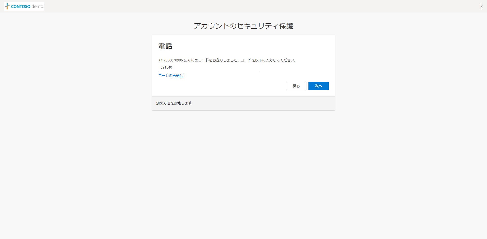
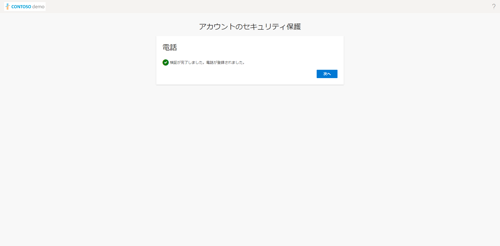
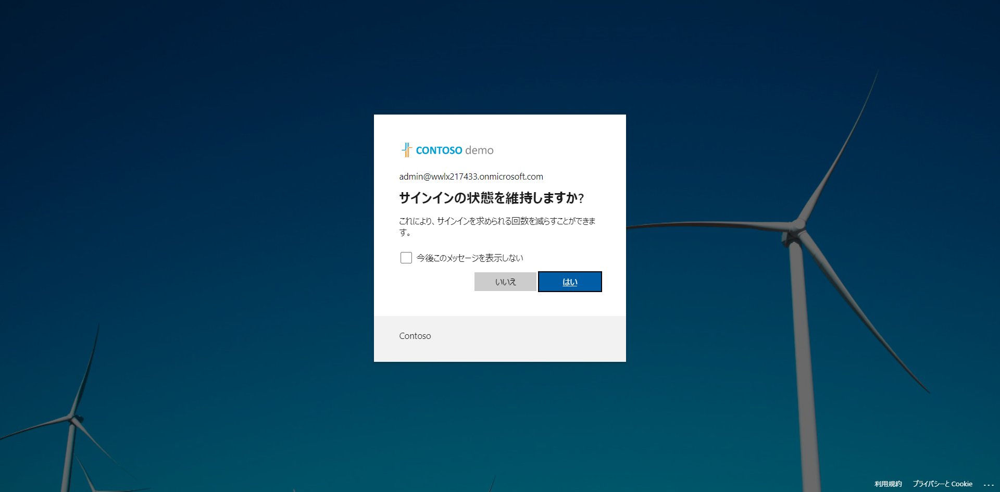
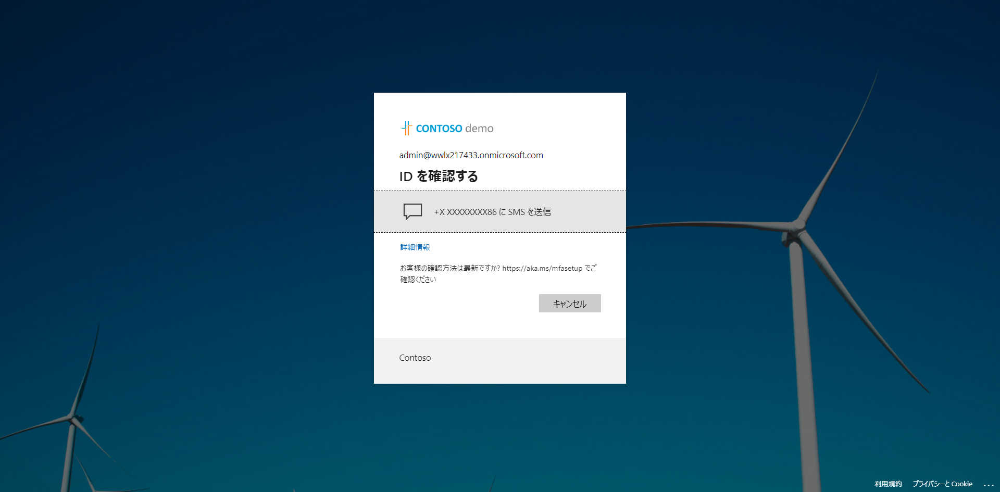

## 研修用アカウントの確認方法
1. 事前にお渡ししたSkillableのURLにアクセスし、**Signin** をクリックします。

2. サインイン画面で事前にお渡ししたSkillableのID/パスワードを入力してサインインします。

3. 画面に表示されるクラス情報のリンクをクリックします。

4. 続く画面で **契約を表示** をクリックします。

5. 使用許諾契約画面で **Agree** をクリックします。

6. 元の画面に戻ったら **Launch** をクリックします。

7. 別ウィンドウが開き、仮想マシンが起動します。仮想マシンが起動したら画面右上の **Resources** をクリックします。すると資格情報 (研修で使用するアカウント) が確認できます。

