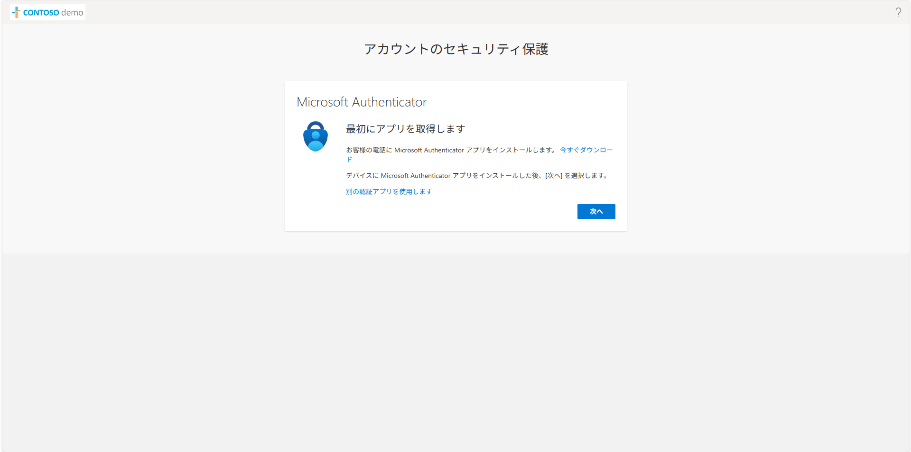

## 多要素認証の設定方法
1. ユーザー名とパスワードを利用してサインインを行うと次のような画面が登場します。**次へ** をクリックします。

2. アカウントのセキュリティ保護画面で、**別の方法を設定します** をクリックします。

3. アカウントのセキュリティ保護画面で、**次へ** をクリックします。

4. アカウントのセキュリティ保護画面で、**画像をスキャンできませんか？** をクリックします。

5. アカウントのセキュリティ保護画面で、秘密鍵の文字列をコピーし、**次へ** をクリックします。

6. 新しいタブを開き、**https://totp.danhersam.com/** にアクセスします。
TOTP Token Generator 画面で、Your Secret Key 欄に前の手順でコピーした秘密鍵の文字列を貼り付けます。
最下段に表示される数字をコピーします。

8. アカウントのセキュリティ保護画面に戻り、前の手順でコピーした文字列を貼り付け、**次へ** をクリックします。

9. 登録が完了したら **次へ** をクリックします。

10. **完了** をクリックします。

11. サインインの状態を維持しますか？画面で、**いいえ** をクリックします。すると多要素認証の設定とサインインが完了します。

##【参考】Microsoft Authenticator を利用する場合の多要素認証の設定方法
1. ユーザー名とパスワードを利用してサインインを行うと次のような画面が登場します。**次へ** をクリックします。

2. アカウントのセキュリティ保護画面で、**次へ** をクリックします。

3. アカウントのセキュリティ保護画面で、**次へ** をクリックします。

4. アカウントのセキュリティ保護画面で、表示されるQRコードを Microsoft Authenticator アプリから読み取り、**次へ** をクリックします。

5. Microsoft Authenticator アプリに届いた通知画面に、PC画面上に表示されている記載の番号を入力します。

6. 登録が完了したら **次へ** をクリックします。

7. **完了** をクリックします。

8. サインインの状態を維持しますか？画面で、**いいえ** をクリックします。すると多要素認証の設定とサインインが完了します。

9. 次回以降、サインインを行うとユーザー名とパスワードを入力した後に次の画面が登場します。
手順5 に記載の操作を繰り返するとサインインが完了します。

